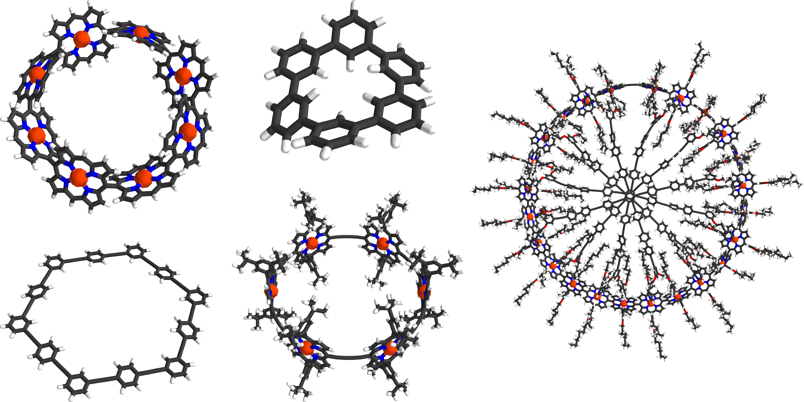
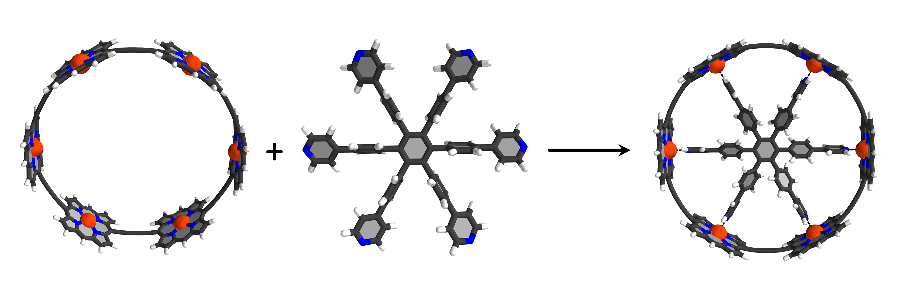
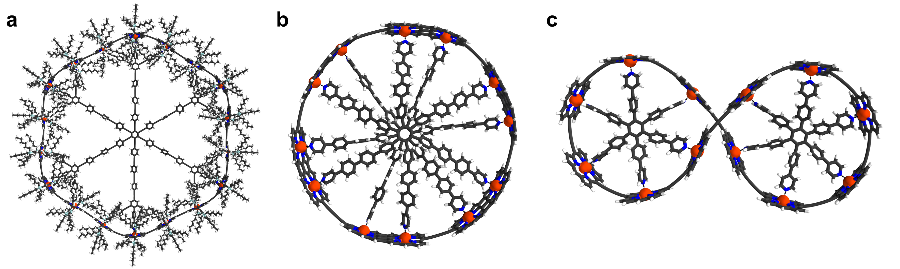
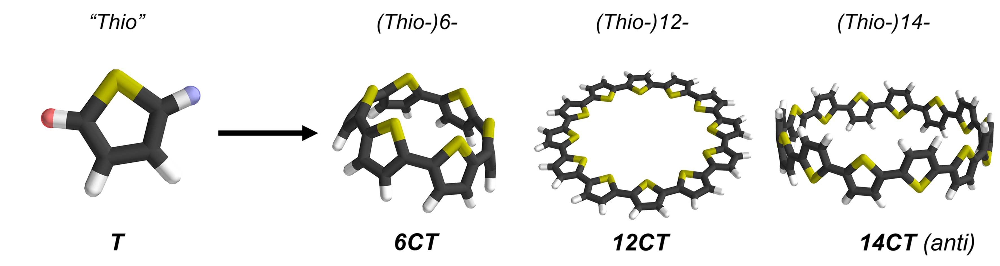

# RingGen
RingGen is a program to generate MM-optimized supramolecular structures. It uses fragment to automatically construct larger systems. It was originally developed to model porphyrin nanorings but cutom fragments can be included by simply adding .xyz coordinate files. It generates GAFF force field parameters for the MM-optimization, which can be used for MD simulations afterwards. In addition, the program can dock molecular template molecules to ring structures to aid modeling template complexes for template-directed synthesis of nanorings.




## Usage
Structures are generated by defining the sequence of building blocks as a string of their names separated by "-". For example, the pattern "H-Alk-Por-Alk-Alk-Por-Alk-H" creates a system with two porphyrin units connected by a butadiyne linker. A normal workflow for generating a simple template complex looks like:
```python
import RingGen

#Generate cP6 ring from default fragments
cP6 = RingGen.PorphyrinStructure().define_pattern("Alk-Por-Alk-"*6).build()

#Parameterize T6 template from an existing .xyz file
T6 = RingGen.Structure().set_coordinates("T6.xyz")
T6.generate_topology_from_coordinates()

#Dock cP6 ring and T6 template
cP6_T6 = RingGen.DockingStructure([cP6, T6]).dock()
```
The resulting structes:


While the above example is straightforward to model manually, the program reduces the time needed to generate structures of complicated template complexes to a few seconds and can be used to screen different templates:


Custom building blocks can be included by adding them to the RingGen.defaults from an .xyz file, which needs to contain a list of the hydrogen atoms that are removed to form connecting points on the comment line (second line of .xyz file).
```python
RingGen.defaults.add_fragment_from_file("Thio.xyz")
```


## Imports
The program makes extensive use of numpy structures and methods and most simple operations of RingGen need no further imports. The generation of force field parameters for custom building blocks requires MOPAC for AM1 charge calculations. The default optimizer is L-BFGS implemented in openMM, but a simple gradient descent algorithm is also included if openMM is not available; the openMM optimizer is faster for very large structures.
